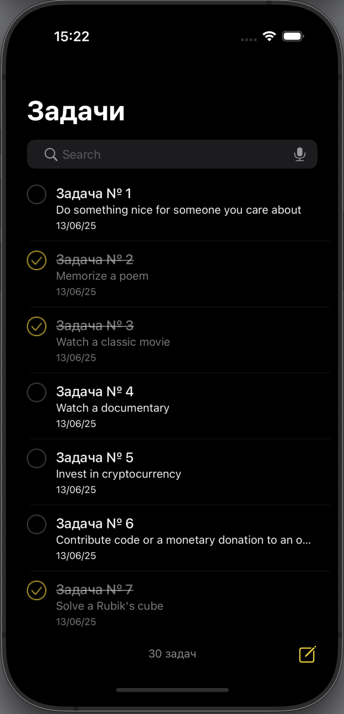
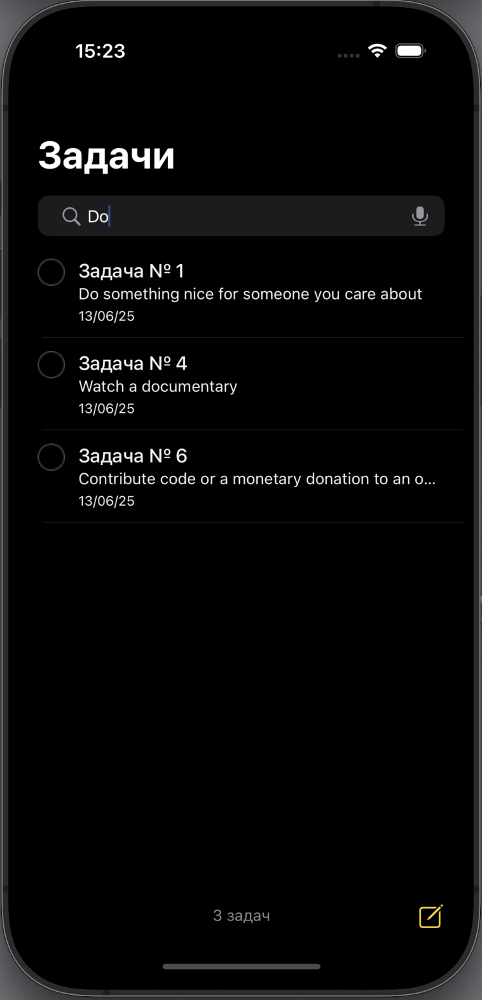
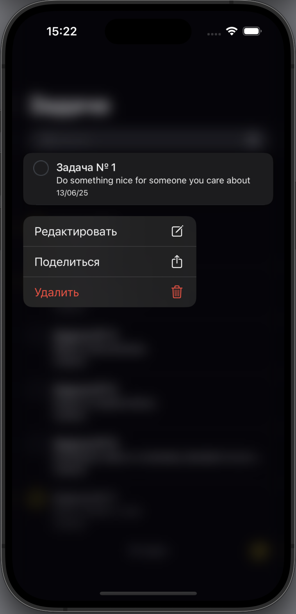
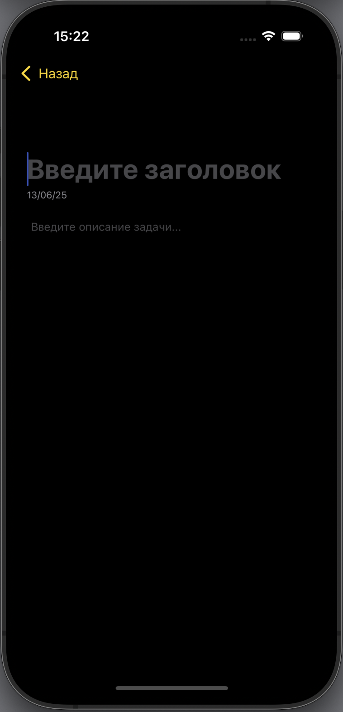

# 📝 ToDoIOSApp

**ToDoIOSApp** — iOS-приложение для управления задачами, реализованное с использованием архитектуры VIPER и CoreData. Интерфейс оформлен в тёмной теме в соответствии с макетом из Figma.

---

## 🚀 Основные возможности

- Просмотр списка задач
- Добавление, редактирование и удаление задач
- Поддержка долгого нажатия и контекстного меню
- Хранение данных в CoreData
- Загрузка задач
- Поиск задач

---

## 🧱 Архитектура

- VIPER (View, Interactor, Presenter, Entity, Router)
- UIKit + CoreData
- GCD для работы с многопоточностью
- Mock-интерфейсы и юнит-тесты

---

## 📦 Используемые технологии

- **UIKit** — UI-компоненты  
- **VIPER** — архитектурный подход  
- **CoreData** — локальное хранилище  
- **GCD** — асинхронные операции  
- **REST API** — внешние задачи (мок)  
- **Figma** — дизайн в тёмной теме  
- **XCTest** — модульное тестирование  

---

## 🛠 Требования

- Xcode 15+  
- iOS 15.0+  

---

## 📸 Прогресс реализации

| Экран / Функция             | Статус |
|-----------------------------|--------|
| Список задач                | ✅      |
| Ячейки + кастомная таблица  | ✅      |
| Поиск                       | ✅      |
| Подключение VIPER           | ✅      |
| CoreData                    | ✅      |
| Загрузка задач с API        | ✅      |
| Контекстное меню и long tap | ✅      |
| Тёмная тема из Figma        | ✅      |
| Покрытие логики тестами     | ✅      |

---

## 📁 Структура проекта

```plaintext
├── README.md
├── ToDoIOSApp/
│   ├── App/
│   │   ├── AppDelegate.swift
│   │   ├── AppRouter.swift
│   │   ├── SceneDelegate.swift
│   ├── Base.lproj/
│   ├── Info.plist
│   ├── Mocks/
│   │   ├── MockTodoJSON.swift
│   ├── Modules/
│   │   ├── TaskDetail/
│   │   │   ├── Interactor/
│   │   │   │   ├── TaskDetailInteractor.swift
│   │   │   ├── Presenter/
│   │   │   │   ├── TaskDetailPresenter.swift
│   │   │   ├── Protocols/
│   │   │   │   ├── TaskDetailInteractorInput.swift
│   │   │   │   ├── TaskDetailInteractorOutput.swift
│   │   │   │   ├── TaskDetailRouterInput.swift
│   │   │   │   ├── TaskDetailViewInput.swift
│   │   │   │   ├── TaskDetailViewOutput.swift
│   │   │   │   ├── TaskListUpdater.swift
│   │   │   ├── Router/
│   │   │   │   ├── TaskDetailRouter.swift
│   │   │   ├── TaskDetailModuleBuilder.swift
│   │   │   ├── View/
│   │   │   │   ├── TaskDetailViewController.swift
│   │   ├── TaskList/
│   │   │   ├── Entity/
│   │   │   │   ├── TaskModel+Mapping.swift
│   │   │   │   ├── TaskModel.xcdatamodeld/
│   │   │   │   │   ├── TaskModel.xcdatamodel/
│   │   │   │   │   │   ├── contents
│   │   │   │   ├── TodoResponse.swift
│   │   │   ├── Interactor/
│   │   │   │   ├── TaskListInteractor.swift
│   │   │   ├── Presenter/
│   │   │   │   ├── TaskListPresenter.swift
│   │   │   ├── Protocols/
│   │   │   │   ├── TaskListInteractorInput.swift
│   │   │   │   ├── TaskListInteractorOutput.swift
│   │   │   │   ├── TaskListRouterInput.swift
│   │   │   │   ├── TaskListViewInput.swift
│   │   │   │   ├── TaskListViewOutput.swift
│   │   │   ├── Router/
│   │   │   │   ├── TaskListRouter.swift
│   │   │   ├── TaskListModuleBuilder.swift
│   │   │   ├── View/
│   │   │   │   ├── SearchBarView.swift
│   │   │   │   ├── TaskListViewController.swift
│   │   │   │   ├── TaskTableViewCell.swift
│   ├── Resources/
│   │   ├── Assets.xcassets/
│   │   │   ├── AccentColor.colorset/
│   │   │   │   ├── Contents.json
│   │   │   ├── AppIcon.appiconset/
│   │   │   │   ├── Contents.json
│   │   │   ├── Contents.json
│   │   │   ├── checkbox_checked.imageset/
│   │   │   │   ├── Contents.json
│   │   │   │   ├── checkbox_checked.png
│   │   │   ├── checkbox_unchecked.imageset/
│   │   │   │   ├── Contents.json
│   │   │   │   ├── checkbox_unchecked.png
│   │   ├── Base.lproj/
│   │   │   ├── LaunchScreen.storyboard
│   ├── Storage/
│   │   ├── CoreData/
│   │   │   ├── CoreDataManager.swift
│   │   │   ├── TaskEntity.swift
│   ├── Utilities/
│   │   ├── Style.swift
│   │   ├── UIColor+Extensions.swift
├── ToDoIOSApp.xcodeproj/
│   ├── project.pbxproj
│   ├── project.xcworkspace/
│   │   ├── contents.xcworkspacedata
│   │   ├── xcshareddata/
│   │   │   ├── swiftpm/
│   │   │   │   ├── configuration/
│   │   ├── xcuserdata/
│   │   │   ├── ekaterinasaveleva.xcuserdatad/
│   │   │   │   ├── IDEFindNavigatorScopes.plist
│   │   │   │   ├── UserInterfaceState.xcuserstate
│   ├── xcshareddata/
│   │   ├── xcschemes/
│   │   │   ├── ToDoIOSApp.xcscheme
│   │   │   ├── ToDoIOSAppTests2.xcscheme
│   ├── xcuserdata/
│   │   ├── ekaterinasaveleva.xcuserdatad/
│   │   │   ├── xcdebugger/
│   │   │   │   ├── Breakpoints_v2.xcbkptlist
│   │   │   ├── xcschemes/
│   │   │   │   ├── xcschememanagement.plist
├── ToDoIOSAppTests2/
│   ├── TaskListInteractorTests.swift
│   ├── ToDoIOSAppTests2.swift
│   ├── ToDoIOSAppTests2LaunchTests.swift
├── ToDoIOSAppTests2.xctestplan
```

---

## 📷 Скриншоты

| Главный экран | Поиск задач |
|---------------|--------------|
|  |  |

| Контекстное меню | Новый таск |
|------------------|------------|
|  |  |
